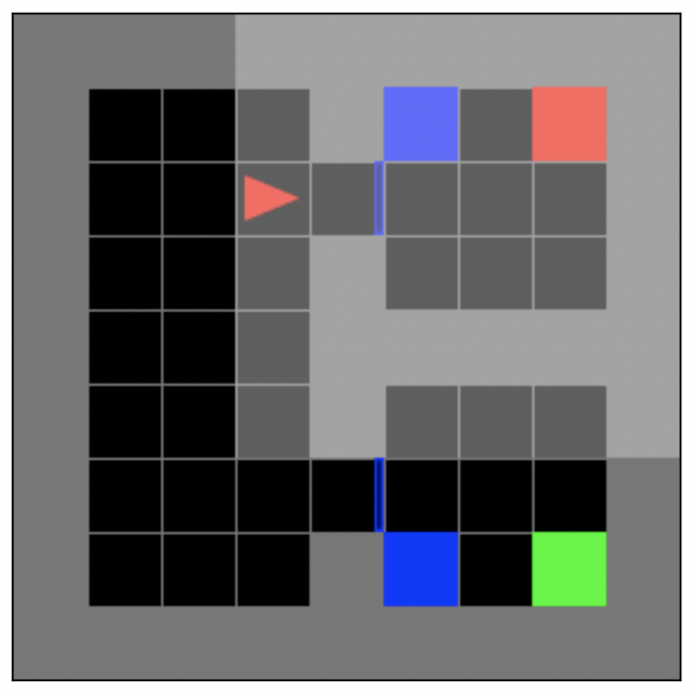
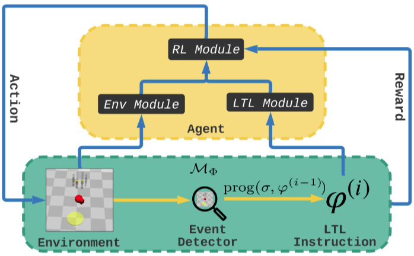

# LTL2Action: LTL Instructions for multi-task Reinforcement Learning 
The repository implements a reinforcement learning algorithm to address the problem of instruct RL agents to learn temporally extended goals in multi-task environments. The project is based on the idea introduced in [LTL2Action](https://arxiv.org/pdf/2102.06858.pdf)


## Environment

The environment is implemented with [gym-minigrid](https://github.com/maximecb/gym-minigrid): an agent (red triangle) must navigate in a 7x7 map. There are walls (grey squares), goals (colored squares) that are shuffled at each episode and doors (blue rectangles). The actions are _go straight_, _turn left_, _turn right_ and the observations returned are the 7x7 colored grid and the orientation of the agent codified by an integer.




## Method



We implemented a RL framework with LTL instructions which learn to solve complex tasks (formalized in LTL language) in challenging environments. At every iteration the RL agent can partially observe the environment sorrounding it and through an event detector a set of truth assignments which are going to somehow simplify (through the progression function) the LTL instruction, i.e. the remaining tasks to be accomplished.
Therefore, the overall method relies on two modules which serve as feature extractors: one for the observation of the environment and one for the LTL instruction, which are later combined together to forms the input of a standard RL algorithm (such as PPO).


## Results

The paper's method is able to solve multi-task environments with an high success rate.
To make the agent generalize over the task formulas, every episode is descripted with a different LTL task sampled from a finite set. 
In the following plot, a normal PPO agent and the novel agent are trained on the same environment.
The two task taken in consideration are: 

* go to *blue* THEN go to *red*
* go to *blue* THEN go to *green*

A Myopic agent reach a success rate of 50%, meaning that it cannot "see" what is the successive goal after the blue one.

METTERE LA FOTO QUA


The agent is then trained over a variety of LTL tasks, like ordered tasks and avoidance.
Here some example videos:

METTERE VIDEO QUA


## Installation

### Requirements
* [Stable-Baselines3](https://stable-baselines3.readthedocs.io/en/master/)
* [gym-minigrid](https://github.com/maximecb/gym-minigrid)

or, for better compatibility, the following command can be used

### Create the environment
```
conda env create -f environment.yml
```

## How to Use

### Training

```
python train.py
```

### Test

```
python test.py
```

